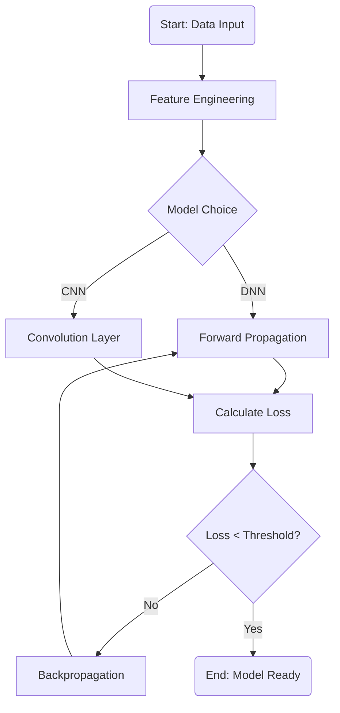

#Mermaid

Obsidian에서 수학 공식(LaTeX)만큼이나 유용한 것이 바로 **Mermaid**입니다. Mermaid는 텍스트를 기반으로 복잡한 다이어그램과 차트를 그려주는 도구로, AI 모델의 구조(Flowchart)나 데이터 흐름(Sequence)을 정리할 때 필수적입니다.

Obsidian에서 Mermaid를 사용하려면 코드 블록을 **` ```mermaid `**로 시작하면 됩니다.

---

### 1. 주요 다이어그램 종류 및 기본 문법

#### ① 순서도 (Flowchart)

AI 알고리즘의 단계나 로직의 흐름을 표현할 때 가장 많이 사용합니다.

- **방향 설정:** `graph TD` (위에서 아래로), `graph LR` (왼쪽에서 오른쪽으로)
    
- **기본 구조:** `[노드 이름] --> [연결선] --> [노드 이름]`
    

|**기호/구조**|**예시 문법**|**의미 및 용도**|
|---|---|---|
|`A[텍스트]`|`A[Input Data]`|사각형: 일반적인 단계 또는 데이터|
|`A(텍스트)`|`A(Start)`|라운드 사각형: 시작 또는 종료|
|`A{텍스트}`|`A{Is Loss < 0.01?}`|마름모: 조건문 (Yes/No 분기)|
|`A[(텍스트)]`|`A[(Database)]`|원통형: 데이터베이스, 저장소|
|`-->`|`A --> B`|실선 화살표: 일반적인 흐름|
|`-.->`|`A -.-> B`|점선 화살표: 보조적인 흐름 또는 참조|
|`==>`|`A ==> B`|굵은 화살표: 강조된 흐름|

#### ② 시퀀스 다이어그램 (Sequence Diagram)

객체 간의 상호작용이나 AI 모델의 추론(Inference) 과정을 시간 순서대로 보여줄 때 유용합니다.

|**문법**|**의미**|**용도**|
|---|---|---|
|`participant A`|참가자 정의|사용자, 서버, 모델 등 주체 설정|
|`A ->> B`|실선 화살표|메시지 전달 (Request)|
|`B -->> A`|점선 화살표|응답 전달 (Response)|
|`Note over A`|노트 표시|특정 단계에 대한 상세 설명 추가|
|`loop` ... `end`|반복 구간|Epoch 반복 학습 과정 표현|

#### ③ 개체 관계도 (ER Diagram)

데이터베이스 설계나 AI 학습 데이터셋의 구조(스키마)를 정의할 때 사용합니다.

|**문법**|**의미**|**용도**|
|---|---|---|
|`ENTITY { }`|개체 정의|데이터 테이블 정의 (속성 포함)|
|`||--o{`|
|`string`, `int`|데이터 타입|데이터의 성격 명시|

---

### 2. AI 공부를 위한 Mermaid 활용 예시 (Obsidian용)

Obsidian 노트에 아래 코드를 복사해서 넣어보시면 다이어그램이 생성됩니다.

#### [예시] 신경망 학습 프로세스 (Flowchart)

코드 스니펫



---

### 3. [최종 정리] Mermaid 문법 요약 표

|**구분**|**주요 키워드**|**읽는 법/의미**|**비고**|
|---|---|---|---|
|**선언**|`graph`, `flowchart`|다이어그램 시작|상단에 반드시 입력|
|**방향**|`TD` / `LR` / `RL`|Top-Down / Left-Right|흐름의 방향 결정|
|**도형**|`[ ]` / `( )` / `{ }`|박스 / 라운드 / 다이아몬드|노드의 형태 결정|
|**연결**|`-->` / `---` / `-- text -->`|화살표 / 실선 / 텍스트 포함|관계 및 흐름 설명|
|**스타일**|`style A fill:#f9f`|스타일 지정|노드의 색상, 테두리 등 변경|
|**특수**|`subgraph` ... `end`|서브그래프|그룹화 (예: 'Hidden Layers')|

**Obsidian 활용 팁:**

- **Live Preview:** Obsidian의 라이브 미리보기 모드에서는 작성 즉시 결과가 보입니다.
    
- **클릭 이벤트:** Mermaid 노드에 링크를 걸어 다른 노트로 이동하게 만들 수도 있습니다. (`click A "obsidian://open?..."`)
    
- **복잡한 모델:** Transformer나 ResNet 같은 복잡한 구조는 `subgraph`를 활용해 계층별로 묶어서 정리하면 가독성이 비약적으로 좋아집니다.