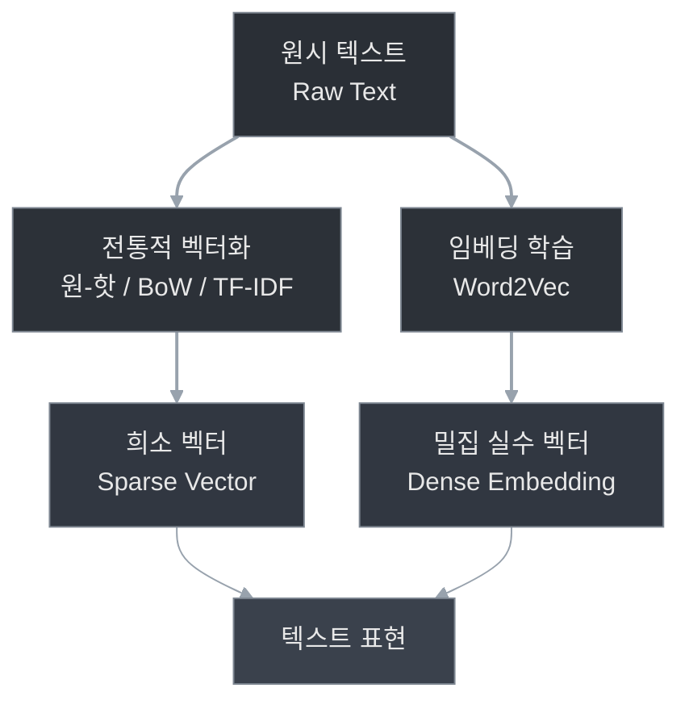

[[이론부터 실전까지 AI에이전트 완벽 마스터]]

> [!note] '이 책에서 사용하는 내용들'
> https://github.com/ai-agent-kr/Modern-AI-Agents
> Python 3.10+
> PyTorch/Transformers
> Streamlit
> Docker

# AI를 위한 텍스트 표현

## 원-핫 인코딩

## 단어 가방

## TF-IDF

# 임베딩, 응용 그리고 표현

## word2vec

## 텍스트의 유사도 개념

## 임베딩의 속성

# 텍스트 처리를 위한 RNN, LSTM, GRU, CNN

## 순환 신경망

## 장단기 메모리

## 게이트 순환 유닛

## 텍스트용 CNN

# 임베딩과 딥러닝을 활용한 감정 분석